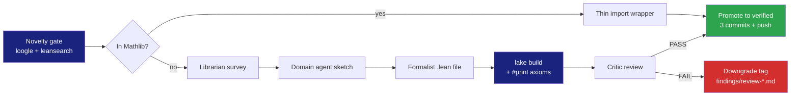
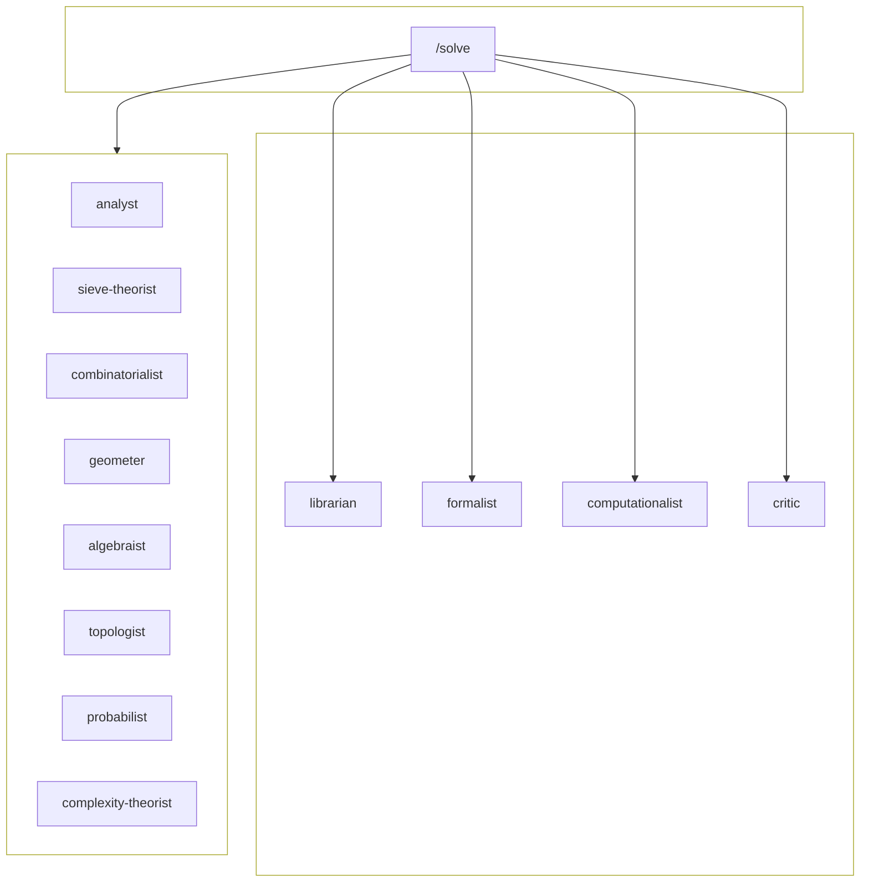
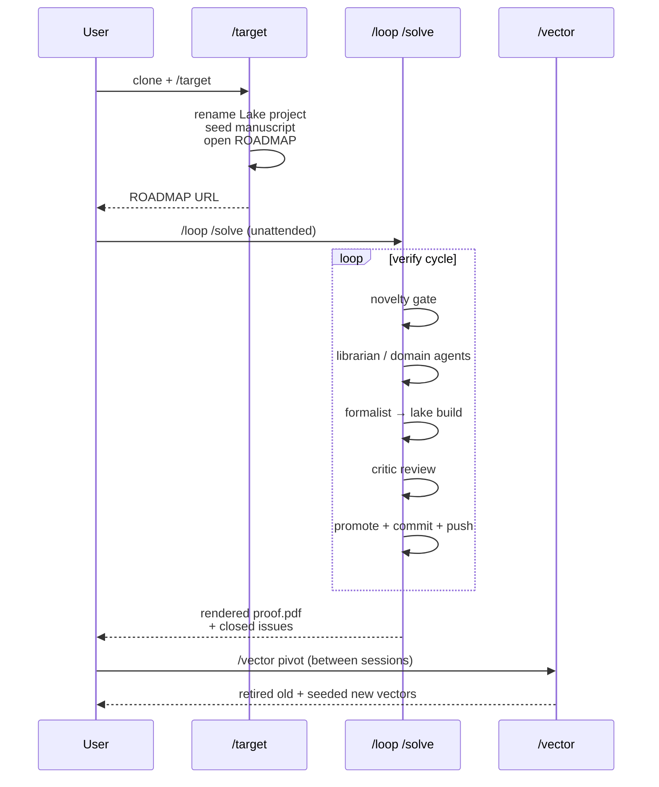

<a id="top"></a>
<div align="center">

# Formalia

### Autonomous Lean 4 proof harness for open mathematical problems

[Quick Start](#-quick-start) • [How It Works](#-how-it-works) • [Agents](#-the-agents) • [Skills](#-the-skills) • [Verification](#-verification-gates) • [FAQ](#-faq)

[](https://leanprover.github.io)
[](https://github.com/leanprover-community/mathlib4)
[](https://docs.claude.com/claude-code)
[](https://github.com/<GH_USERNAME>/formalia/generate)
[](LICENSE)

</div>

---

## Overview

Formalia is a GitHub template for attacking open mathematical problems with an LLM-driven proof harness whose trust root is the **Lean 4 kernel**. Clone the template, point it at a problem, and run the autonomous loop.

- **Lean kernel is the trust root** — every `[verified]` claim is checked by `lake build` plus `#print axioms` against the three Lean foundational axioms
- **Mathlib reuse before reproof** — a mandatory novelty gate (loogle + leansearch) makes every subgoal start with "is this already formalized?"
- **Twelve specialist agents** — analyst, sieve theorist, combinatorialist, geometer, algebraist, topologist, probabilist, complexity theorist, formalist, computationalist, librarian, critic
- **Three slash-commands** — `/target` (bootstrap), `/solve` (autonomous loop), `/vector` (vector lifecycle)
- **Honest tagging discipline** — every claim is `[verified]` / `[sketch]` / `[conditional]` / `[numerical]` / `[heuristic]`
- **Publication-quality manuscript** — `manuscript/proof.tex` reads like an arXiv preprint, rebuilt to PDF each session by `tectonic`
- **GitHub-Issues work queue** — ROADMAP issue with checkbox-tracked sub-lemmas; one repo per problem

The deliverable is a machine-checked Lean 4 proof and a publication-style PDF. LLM output is intuition, not proof; the kernel decides.

---

## 🚀 Quick Start

**Prerequisites:** [`elan`](https://github.com/leanprover/elan) (Lean toolchain manager), [`uv`](https://docs.astral.sh/uv/) (Python), [`tectonic`](https://tectonic-typesetting.github.io/) (LaTeX → PDF), [`gh`](https://cli.github.com/) (GitHub CLI), [Claude Code](https://docs.claude.com/claude-code)

```bash
# 1. Clone the template into a new private repo on your account.
#    Replace <upstream-owner> with whoever hosts the template you're
#    cloning (typically the upstream you forked from, or your own
#    account if you keep your own fork of the template).
gh repo create --template <upstream-owner>/formalia <your-username>/<problem-name> --private --clone
cd <problem-name>

# 2. One-time per-clone setup. Prompts for your GitHub username, full
#    name, and email; substitutes the GH_USERNAME, GIT_USER_NAME, and
#    GIT_USER_EMAIL placeholders across the template; writes the
#    repo-local git config. Idempotent — safe to re-run.
#
#    Non-interactive form:
#      GH_USERNAME=foo GIT_USER_NAME='Foo Bar' \
#        GIT_USER_EMAIL=foo@bar.example make init
make init

# 3. Bootstrap — defines the problem, scaffolds the Lake project, opens
#    ROADMAP, and replaces this README with a problem-specific entry
#    page (status / verified / open blocks refreshed each session).
#    Interactive; uses AskUserQuestion. (In Claude Code.)
/target

# 4. Run autonomously. Designed for unattended multi-hour sessions;
#    the harness commits and pushes per work unit. Halts on its own
#    when the ROADMAP shows N/N closed (see "anti-overreach" in
#    CLAUDE.md).
/loop /solve

# 5. (Optional, after the loop halts.) Polish the manuscript for
#    publication — rewrite the abstract, expand the introduction,
#    attach footnote-links from each theorem to its Lean file,
#    add the "Formal verification" appendix with verbatim Lean
#    snippets, rebuild the PDF. Mostly autonomous; one commit.
/polish
```

Between sessions, when the strategic landscape shifts, run `/vector` to add, retire, or pivot attack vectors.

> First `/solve` session fetches Mathlib's prebuilt `.olean` cache (~3 GB, ~5 min on first machine). Subsequent builds are incremental.

---

## 🔧 How It Works

The harness encodes one named pattern: the **verify cycle**. Each iteration produces either a verified Lean theorem or an honestly-tagged dead-end.



The **novelty gate** (step 0) is non-optional. Mathlib formalizes a vast amount of mathematics; before formalizing *anything*, the harness queries `loogle.lean-fro.org` (type-shaped queries) and `leansearch.net` (English queries). If Mathlib has the result, the subgoal collapses to a one-line import wrapper — one ROADMAP checkbox ticked in one commit, no reformalization. Skipping the gate is the documented anti-pattern: sessions get burned reformalizing folklore that already lives upstream.

### Honest tagging

Every claim in `manuscript/proof.tex` carries a single-line LaTeX comment recording its verification status:

| Tag | Meaning |
|---|---|
| `% [verified: formal/X.lean]` | `lake build` succeeds, `#print axioms` lists only the three Lean foundational axioms, critic PASS |
| `% [sketch]` | Informal argument present (or being written). Not yet formalized |
| `% [conditional on H]` | Verified *conditional* on a named open hypothesis (RH, GRH, etc.) |
| `% [numerical: <range>]` | Verified for a finite range by a script under `formal/numerics/` |
| `% [heuristic]` | Empirical pattern only |

The comment is invisible in the rendered PDF but `grep`-able for future sessions. A discreet footnote on the main theorem points to the `.lean` file with the Mathlib commit SHA baked in for reproducibility.

---

## 🧠 The Agents

Twelve specialists live under `.claude/agents/`. The orchestrator (`/solve`) dispatches them by subgoal type; they run in parallel when independent.



### Cross-cutting agents

| Agent | Specialty | When dispatched |
|---|---|---|
| `formalist` | Lean 4 + Mathlib formalization, tactic guidance, axiom checks | Every promotion candidate |
| `computationalist` | Python (`uv`) scripts, `gmpy2`, SAT runners | Finite-range computational evidence |
| `librarian` | arXiv + Mathlib + Reservoir + MathOverflow + Polymath | Before any non-trivial sketch |
| `critic` | Adversarial review, axiom whitelist, famous-hypothesis check | After every formalization, before promotion |

### Domain specialists

| Agent | Specialty | When dispatched |
|---|---|---|
| `analyst` | Analytic NT: circle method, exp sums, L-functions, zero-free regions | NT subgoal with asymptotic content |
| `sieve-theorist` | Brun / Selberg / large sieve / GPY-Maynard | Counting primes / almost-primes in AP or short intervals |
| `combinatorialist` | Sumsets, Plünnecke–Ruzsa, Freiman, Green–Tao transference | Additive combinatorics, density bounds, AP-counting |
| `geometer` | Unit distance, chromatic numbers, incidence bounds, packings | Discrete / combinatorial geometry |
| `algebraist` | Groups, rings, fields, representations, Galois theory | Algebraic structure / invariant inequalities |
| `topologist` | Homology, knot invariants, Borsuk–Ulam, simplicial methods | Topological invariants / topological combinatorics |
| `probabilist` | Chernoff / Azuma / Talagrand, LLL, entropy method | Concentration claims, probabilistic-method existence |
| `complexity-theorist` | SAT / SMT encodings, LRAT certificates, reductions | Finite search via SAT, Lean LRAT bridging |

> **Per-clone extensibility**: a clone that needs a missing specialist (e.g., `logician`, `category-theorist`, `algebraic-geometer`, `differential-geometer`) drops a new `<name>.md` into `.claude/agents/`. The orchestrator picks it up automatically.

---

## 🎛 The Skills

Four slash-commands live under `.claude/skills/`. Two interactive, two autonomous.

| Skill | Mode | Purpose |
|---|---|---|
| **`/target`** | Interactive (`AskUserQuestion`) | One-time bootstrap. Asks for problem name + field + statement + initial vectors. Renames the Lake project from the `Formalia` placeholder. Seeds the manuscript, opens ROADMAP + librarian-survey issues. **Run once per clone.** |
| **`/solve`** | Autonomous (no user input) | Resumes from ROADMAP + open Issues + git log. Picks the next subgoal, runs the novelty gate, dispatches sub-agents, runs the verify cycle, commits + pushes. Wrap with `/loop /solve` for sustained sessions. Halts automatically when the ROADMAP shows `N/N closed` — see CLAUDE.md § "Anti-overreach". |
| **`/vector`** | Interactive (`AskUserQuestion`) | Three modes — `add` (seed a new vector), `retire` (close with reason → `deadend` or `deprioritized`), `pivot` (multi-retire + strategic rationale + replacements, with a `findings/pivot-DATE.md` ceremony). |
| **`/polish`** | Autonomous (no user input) | Final-pass manuscript polish, run after the loop halts. Audits the `.tex` against publication standards (abstract written, introduction structured, every theorem has a footnote linking to its Lean file, no scaffolding leftover), adds or refines the "Formal verification" appendix with verbatim Lean snippets, runs `critic` over the polished draft, rebuilds the PDF. One commit. |

### Typical session flow



---

## ✅ Verification Gates

What makes a theorem `[verified]`:

1. **`lake build` exits 0** — the `.lean` file compiles against the pinned Mathlib SHA.
2. **`#print axioms <ThmName>`** lists **only**:
   - `propext` (propositional extensionality)
   - `Classical.choice` (classical choice / excluded middle)
   - `Quot.sound` (quotient soundness)

   These three are how Mathlib certifies its theorems. Their presence is normal.
3. **`critic` PASS** — adversarial review (stronger-than-target test, famous-hypothesis check, WLOG/clearly expansion, uniformity check, parity-barrier check, sign / scale check).

### Disqualifying axioms

| Axiom | Why disqualifying |
|---|---|
| `sorryAx` | A `sorry` is in the dependency chain. The theorem is asserted, not proved. Send back to formalist. |
| `Lean.ofReduceBool` | A `native_decide` is in the chain. The proof depends on compiled-Lean evaluation, not on the kernel's reduction. Allowed **case-by-case** after explicit critic review, not by default. |
| Any project-local `axiom <name> : <type>` | Hard no — disqualifies promotion. |

Any of these in the `#print axioms` output keeps the claim at `[sketch]` regardless of what else is true.

---

## 📁 Project Structure

```
your-clone/
├── CLAUDE.md                          # Project operating instructions (loaded every session)
├── STATUS.md                          # Brief live pointer (last session, focus, blocker)
├── README.md                          # User-facing docs
├── LICENSE                            # MIT
├── Makefile                           # `make init` / `make help`
├── pyproject.toml + uv.lock           # Python deps (managed by uv)
│
├── scripts/
│   └── init.py                        # One-time per-clone setup (run via `make init`)
│
├── .claude/
│   ├── agents/                        # 12 subagent definitions
│   └── skills/
│       ├── target/SKILL.md            # One-time bootstrap
│       ├── solve/SKILL.md             # Autonomous-session skill
│       ├── vector/SKILL.md            # Interactive vector add/retire/pivot
│       └── polish/SKILL.md            # Final-pass manuscript polish
│
├── manuscript/
│   ├── proof.tex                      # Canonical evolving manuscript
│   └── proof.pdf                      # Rendered PDF (committed; rebuilt each session)
│
├── formal/                            # Lake project root
│   ├── lakefile.toml                  # Mathlib pin + library config
│   ├── lean-toolchain                 # Lean version pin
│   ├── lake-manifest.json             # Lockfile (managed by lake)
│   ├── <DisplayName>.lean             # Root module (renamed by /target)
│   ├── <DisplayName>/                 # Per-concept .lean files
│   └── numerics/                      # Python scripts (computationalist)
│
└── findings/                          # Agent-to-agent markdown notes
    └── INDEX.md
```

---

## 🛠 Setup Requirements

| Tool | Why | Install |
|---|---|---|
| **Lean 4 + Mathlib** (via `elan`) | Formal proofs | `curl https://raw.githubusercontent.com/leanprover/elan/master/elan-init.sh -sSf \| sh -s -- -y` — project pins the toolchain via `formal/lean-toolchain` |
| **Python 3** (via `uv`) | Numerical scripts | `brew install uv`; `/target` runs `uv sync` to create `.venv/` |
| **`tectonic`** | LaTeX → PDF (manuscript rebuild) | `brew install tectonic` |
| **`gh` CLI** | GitHub Issues / template clone | `brew install gh && gh auth login` |
| **Claude Code** | Agent orchestrator | [docs.claude.com/claude-code](https://docs.claude.com/claude-code) |
| *(optional)* `cadical` / `kissat` / `z3` | SAT / SMT solvers | `brew install cadical kissat z3` — on demand |
| *(optional)* `sage` | `polyrith` backend in Lean | `brew install --cask sage` — on demand |

Default Python dependencies (from `pyproject.toml`): `sympy`, `gmpy2`, `numpy`, `scipy`, `networkx`, `python-sat`, `mpmath`. Add more with `uv add <pkg>` and commit `pyproject.toml` + `uv.lock`.

---

## ❓ FAQ

### Why Lean 4?

Three reasons. **Mathlib coverage** — the Prime Number Theorem, the Polynomial Freiman–Ruzsa conjecture, the Liquid Tensor Experiment, and a huge swath of modern mathematics are already formalized; the harness's "browse-first, reuse-before-reprove" rule compounds. **LLM training-data abundance** — Mathlib has been on GitHub since well before any LLM cutoff, and recent neural-theorem-proving systems target Lean 4. **Toolchain stability** — `lean-toolchain` + `lake-manifest.json` give per-clone reproducibility that survives upstream churn.

### What if the harness can't make progress?

It writes `findings/deadend-<topic>-<date>.md` explaining the concrete obstacle, commits it, and switches to a different subgoal. The 30-minute cap per stuck subgoal is enforced by `/solve`. If a whole vector stalls, run `/vector retire` (or `/vector pivot` for a strategic shift).

### How does it avoid hallucinating proofs?

The Lean kernel is the trust root. `/solve` independently re-runs `lake build` and `#print axioms` rather than trusting the sub-agent's report. The critic agent reviews adversarially before any `[verified]` promotion. Honest tagging (`[sketch]` / `[conditional]` / `[numerical]` / `[heuristic]`) is mandatory for anything that doesn't clear the axiom gate.

### Can I edit the manuscript myself?

Yes. Commit your edits; `/solve` respects them on the next session. The style enforced by the harness is "publication-quality arXiv preprint" — no project scaffolding, no "Step 1 / Step 2" labels, no "Critic review PASS" remarks. If you edit, follow the same style (see `.claude/skills/solve/SKILL.md` § "Manuscript style").

### How do I switch strategy mid-project?

`/vector pivot`. The skill retires multiple vectors, records a strategic rationale in `findings/pivot-DATE.md`, and seeds replacement vectors in one ceremony commit.

### Why a single squashed initial commit on the template?

Every clone inherits the template at one point in time; dev history is irrelevant to that. A clean initial commit (`init: formalia`) gives every clone a tidy starting point.

---

## 📜 License

MIT — see [LICENSE](LICENSE).

---

<div align="center">

*The kernel decides.*

[Back to top](#top)

</div>
